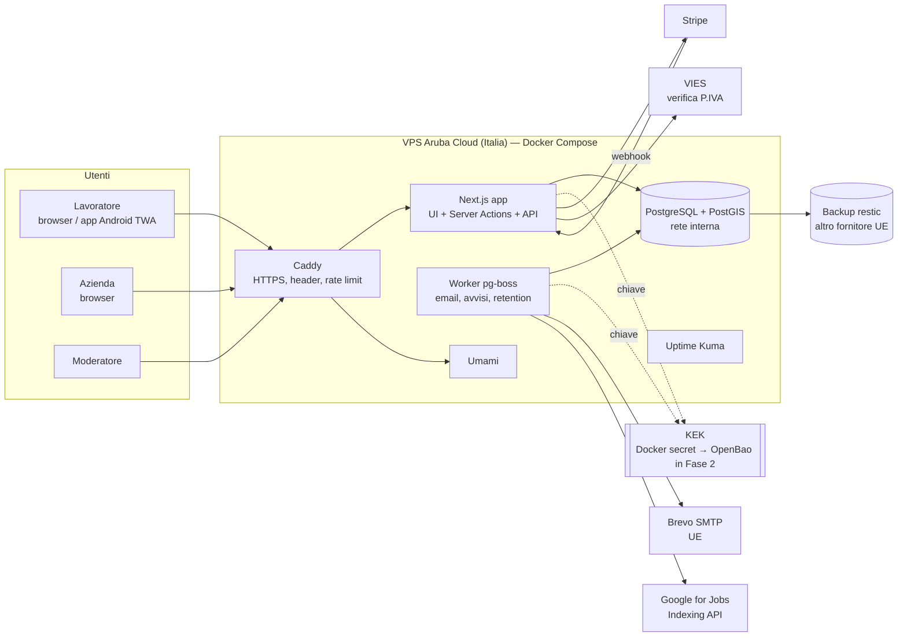
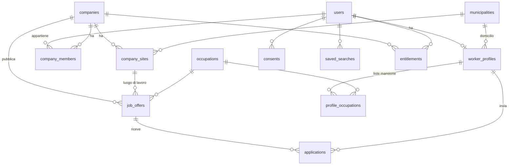

# 03 — Architettura

> Decisioni motivate in [`docs/adr/`](adr/). Qui la visione d'insieme che ogni membro del team (umano o IA)
> deve conoscere prima di scrivere una riga di codice.

## 1. Vincoli che guidano tutto
1. **33 giorni** da martedì 29/09 al 01/11, un solo sviluppatore umano + modelli locali → **meno pezzi possibile**.
2. Codice scritto in gran parte da **modelli locali** (Ollama) → tecnologie **molto diffuse** nei dati di addestramento, file piccoli, contratti espliciti.
3. **Web + Play Store** con un solo codice → PWA + Trusted Web Activity (ADR-0002).
4. **SEO fondamentale** (Google for Jobs è il canale di acquisizione gratuito n.1) → rendering lato server.
5. **Privacy** by design (ADR-0004), **dati in Italia/UE** (ADR-0006).
6. Costi di esercizio **< €50/mese** al lancio.

## 2. Stack (decisioni)

| Livello | Scelta | Perché | ADR |
|---------|--------|--------|-----|
| Linguaggio | **TypeScript** (strict) ovunque | Un solo linguaggio, tipi = contratti per i modelli locali | 0001 |
| Runtime | **Node.js 24 LTS** | LTS attuale | — |
| Framework | **Next.js 16** (App Router, Server Components, Server Actions), React 19 | SSR per SEO, full-stack in un solo progetto, enorme base di esempi | 0001 |
| UI | **Tailwind CSS v4** + **shadcn/ui** (Radix) | Componenti accessibili copiabili, niente dipendenza pesante | — |
| Validazione | **Zod** | Stessi schemi per form, API e test | — |
| DB | **PostgreSQL 17 + PostGIS** | Relazionale, ricerca testuale in italiano, distanze geografiche, code di lavoro: un solo servizio dati | 0003 |
| ORM | **Drizzle ORM** + drizzle-kit (migrazioni SQL versionate) | SQL trasparente, tipi TS, supporto PostGIS | 0003 |
| Ricerca | Postgres **full-text** (`italian` + `unaccent`) + **pg_trgm** (errori di battitura) | Niente Elasticsearch/Meilisearch finché non serve | 0003 |
| Code/cron | **pg-boss** (code su Postgres) | Niente Redis; job di email, avvisi, conservazione | 0003 |
| Auth | **Better Auth** (OTP email / magic link, passkey, 2FA) | Auth.js è passato sotto la gestione del team Better Auth (set. 2025), che lo raccomanda per i nuovi progetti | 0008 |
| Email | **Nodemailer** via SMTP verso **Brevo** (UE) + template **React Email** | Fornitore sostituibile; dev con **Mailpit** | — |
| Pagamenti | **Stripe** (Checkout + Customer Portal + webhook) — solo web | Abbonamenti, fatture, SEPA; niente acquisti in-app all'MVP | 0010 |
| Mobile | **PWA** + **TWA** con **Bubblewrap** | Un solo codice, aggiornamenti senza revisione Play | 0002 |
| Analytics | **Umami** self-hosted, senza cookie | Niente consenso necessario | — |
| Reverse proxy | **Caddy** | HTTPS automatico, header, rate limit semplice | 0006 |
| Deploy | **Docker Compose** su VPS in Italia (Aruba Cloud) | Semplice, economico, dati in Italia | 0006 |
| CI | **GitHub Actions** | lint, typecheck, test, build, audit, deploy | — |
| Test | **Vitest** (unità/integrazione), **Playwright** (e2e), **axe** (accessibilità) | — | — |
| Log | **pino** JSON con `redact` dei campi personali | R-PRIV-05 | — |
| Monitoraggio | **Uptime Kuma** | Uptime, certificati, allarmi | — |
| Backup | **restic** cifrato → object storage UE di altro fornitore | 3-2-1 | — |

> **Versioni esatte:** si fissano nel WP-001 e si scrivono in `VERSIONS.md`. Ogni prompt per i modelli locali
> include le "differenze da ricordare" (es. in Next.js 16 il vecchio `middleware.ts` si chiama `proxy.ts`;
> in Tailwind v4 la configurazione è in CSS con `@theme`; in Next 15+ `params` e `cookies()` sono asincroni).

## 3. Vista d'insieme



## 4. Struttura del codice: monolite modulare in **un solo pacchetto**
Un solo `package.json` (niente monorepo): i modelli locali si confondono con workspace multipli.
I confini tra moduli sono imposti da regole ESLint (`eslint-plugin-boundaries`): un modulo usa gli altri
**solo** tramite il loro `index.ts`.

```
.
├─ src/
│  ├─ app/                         # Route Next.js (solo composizione, niente logica di dominio)
│  │  ├─ (public)/                 # home, ricerca, offerta, pagine SEO, legali
│  │  ├─ (worker)/                 # area lavoratore
│  │  ├─ (company)/                # area azienda
│  │  ├─ (admin)/                  # moderazione
│  │  ├─ api/                      # webhook Stripe, health, endpoint email one-click
│  │  └─ manifest.ts, sitemap.ts, robots.ts
│  ├─ modules/
│  │  ├─ identity/                 # utenti, ruoli, sessioni (Better Auth)
│  │  ├─ profiles/                 # profilo lavoratore, stati, liste mansione
│  │  ├─ companies/                # aziende, sedi, membri, verifica VIES
│  │  ├─ offers/                   # offerte, validatore a norma, moderazione
│  │  ├─ applications/             # candidature
│  │  ├─ matching/                 # ricerca, punteggio, regola zona (regione ∪ 50 km)
│  │  ├─ notifications/            # avvisi, mail 30 giorni, template
│  │  ├─ billing/                  # entitlement, Stripe (flag)
│  │  ├─ ads/                      # slot pubblicitari, sponsorizzazioni
│  │  ├─ privacy/                  # consensi, export, cancellazione, retention
│  │  ├─ trust/                    # segnalazioni DSA, antifrode
│  │  ├─ geo/                      # comuni ISTAT, distanze
│  │  └─ taxonomy/                 # mansioni (ESCO/CP2021), competenze
│  │     # ogni modulo: domain/ (puro, testabile) · server/ (DB, servizi) · ui/ (componenti) · index.ts
│  ├─ lib/                         # crypto, db, env, logger, rate-limit, flags, i18n
│  └─ worker/                      # entrypoint del worker pg-boss
├─ db/migrations/                  # SQL generato da drizzle-kit (versionato, revisionato)
├─ scripts/                        # import comuni, import ESCO, seed sintetico
├─ messages/it.json                # testi UI (Gemini) — niente stringhe cablate nei componenti
├─ tests/e2e/                      # Playwright
├─ twa/                            # progetto Bubblewrap (app Android)
├─ design/                         # asset e workflow ComfyUI
└─ docs/
```

### Regole di dipendenza
- `domain/` **non importa** nulla da Next.js, DB o rete → funzioni pure, testabili con Vitest in millisecondi.
- `server/` usa `lib/db`, `lib/crypto`, e il `domain/` del proprio modulo.
- `app/` chiama solo gli `index.ts` dei moduli.
- Solo `modules/privacy` e `lib/crypto` possono chiamare `decryptPii()`; gli altri moduli ricevono DTO già autorizzati.

## 5. Modello dati (v1)



### Tabelle principali (campi essenziali)
| Tabella | Campi chiave | Classe dati |
|---------|-------------|-------------|
| `users` | `id uuid`, `role`, `email_bidx` (HMAC), `email_enc`, `status`, `created_at`, `last_active_at`, `adult_declared_at` | C1/C2 |
| auth (Better Auth) | `session`, `account`, `verification`, `passkey`, `two_factor` | — |
| `worker_profiles` | `user_id`, `state` (`seeking`/`open`/`hidden`), `municipality_code`, `radius_km`, `relocation_regions[]`, `experience_band`, `available_from`, `contract_prefs[]`, `schedule_prefs[]`, `driving_licenses[]`, `pii_enc` (nome, cognome, telefono, bio, esperienze, formazione), `dek_wrapped`, `key_version`, `monthly_check_opt_in`, `next_check_at`, `unanswered_checks`, `last_interaction_at` | C1 + C2 |
| `profile_occupations` | `user_id`, `occupation_id`, `years` | C1 |
| `profile_skills`, `profile_languages` | id + livello | C1 |
| `companies` | `id`, `vat_number` (P.IVA), `legal_name`, `display_name`, `kind` (`employer`/`agency`), `agency_authorization`, `verified_at`, `status`, `plan` | C0 |
| `company_sites` | `id`, `company_id`, `municipality_code`, `label`, `is_legal_seat`, `approved_at` | C0 |
| `company_members` | `company_id`, `user_id`, `role` (`owner`/`recruiter`) | — |
| `job_offers` | `id`, `company_id`, `site_id`, `title`, `occupation_id`, `description_md`, `municipality_code`, `contract_type`, `schedule`, `hours_per_week`, `salary_min`, `salary_max`, `salary_period`, `salary_basis`, `ccnl`, `remote`, `requirements` (jsonb: patenti, lingue, competenze), `is_l68`, `status`, `published_at`, `valid_through`, `scope` (`local`/`national`), `featured_until`, `search_tsv` (tsvector), `moderation` (jsonb) | C0 |
| `applications` | `id`, `offer_id`, `worker_user_id`, `status`, `message_enc`, `viewed_at`, `closed_at`, `company_visible_until` | C2 |
| `contact_requests` (Fase B) | `company_id`, `worker_user_id`, `offer_id?`, `status`, `expires_at` | C1 |
| `saved_searches` | `user_id`, `query`, `occupation_ids[]`, `municipality_code`, `radius_km`, `frequency` | C1 |
| `consents` | `user_id`, `type`, `version`, `granted_at`, `revoked_at` | — |
| `email_action_tokens` | `token_hash`, `user_id`, `action`, `expires_at`, `used_at` | — |
| `entitlements` | `owner_type`, `owner_id`, `product` (`supporter`, `national`, `featured`), `valid_from`, `valid_to`, `source` (`stripe`/`crowdfunding`/`promo`) | — |
| `reports` (DSA) | `target_type`, `target_id`, `reason`, `details`, `reporter_user_id?`, `status`, `decision`, `statement_of_reasons` | — |
| `audit_log` | `actor`, `action`, `target`, `at`, `ip_hash` (append-only) | — |
| `ad_placements` | `slot`, `advertiser`, `creative`, `geo_scope`, `starts_at`, `ends_at` | C0 |
| `municipalities` | `istat_code` PK, `name`, `province_code`, `region_code`, `centroid geography(Point,4326)` | C0 |
| `regions`, `provinces` | codici ISTAT | C0 |
| `occupations` | `id`, `esco_uri`, `isco_code`, `cp2021_code?`, `label_it`, `synonyms[]`, `group_code` | C0 |
| `skills` | `id`, `esco_uri`, `label_it` | C0 |
| `regional_internship_minimums` | `region_code`, `monthly_min_eur`, `valid_from`, `source_url` | C0 |

### Dati di riferimento
- **Comuni:** elenco ufficiale ISTAT dei comuni (codici, province, regioni) + coordinate dei centroidi da dataset aperto (es. repo `opendatasicilia/comuni-italiani`); script di import idempotente e aggiornabile (i comuni cambiano per fusioni).
- **Mansioni:** **ESCO** (classificazione europea, etichette in italiano, codici ISCO-08) filtrata a ~300 mansioni frequenti per l'MVP + **sinonimi colloquiali** (Gemini: "lavapiatti", "commis", "mulettista", "OSS"…). Mappatura verso ISTAT CP2021 in v1.2.
- **Minimi tirocini per regione:** tabella curata a mano con fonte e data.

## 6. Flussi chiave

### 6.1 Candidatura
1. Lavoratore tocca "Candidati" → Server Action verifica sessione, stato offerta, candidatura non duplicata.
2. Crea `applications` (messaggio cifrato), registra `audit_log`.
3. Job `notify.company.new-application` → email all'azienda (senza dati personali nel corpo: "Hai una nuova candidatura per *Aiuto cuoco*", link all'area riservata).
4. L'azienda apre la candidatura → decifratura dei dati del profilo **autorizzata** (è il destinatario scelto) → `audit_log` `application.view` → stato "vista" visibile al lavoratore.

### 6.2 Regola di zona (pubblicazione)
`canPublishFree(company, offerMunicipality)` = esiste una sede approvata `s` tale che
`region(offer) == region(s)` **oppure** `ST_DWithin(centroid(offer), centroid(s), 50000)`.
Se falso → richiede entitlement `national` (in "periodo fondatori" l'entitlement è concesso gratis).
Funzione in `modules/matching/domain` + query in `server`; test con casi di confine (49,9 km / 50,1 km, comuni di confine regionale).

### 6.3 Mail ogni 30 giorni
Cron giornaliero 09:00 `Europe/Rome` → seleziona `worker_profiles` con `state='open'`, `monthly_check_opt_in`, `next_check_at <= oggi` (a lotti) → calcola le 10 offerte migliori → crea 4 token monouso (hash nel DB) → invia via Brevo con `List-Unsubscribe` + `List-Unsubscribe-Post` → aggiorna `next_check_at += 30 giorni`, `unanswered_checks += 1`. Qualsiasi interazione azzera il contatore. A 6 → `hidden`.

## 7. Ambienti
| Ambiente | Dove | Dati | Scopo |
|----------|------|------|-------|
| `local` | PC di sviluppo, Docker Compose (Postgres+PostGIS, Mailpit) | Solo sintetici (seed) | Sviluppo; qui lavorano Ollama/Codex, ChatGPT, Gemini |
| `production` in **anteprima** (fino al 27/10) | VPS, dominio dell'app, `PREVIEW_MODE=true` | Sintetici + account dei tester (con codice invito) + lista d'attesa reale | L'app Android (TWA) punta qui fin dal primo giorno; i tester provano il prodotto che cresce |
| `production` | VPS, dominio dell'app | Reali | Dal 28/10 (DB azzerato tranne la lista d'attesa) |
| `staging` | VPS, sottodominio `beta.` con accesso protetto | Sintetici | Dopo il lancio: prove prima di ogni rilascio |

> **Sul "per ora in locale":** lo sviluppo resta in locale, ma **serve un indirizzo pubblico HTTPS dalla
> settimana 1**: l'app Android (TWA) deve verificare il dominio (`/.well-known/assetlinks.json`) e i 12+ tester
> devono poterla aprire. Ospitare dal PC di casa espone la rete domestica e dipende da IP dinamico/CGNAT: meglio
> un VPS da pochi euro subito. Alternativa solo per demo: Cloudflare Tunnel.

> **Sulla "porta del dominio Aruba":** usare un **sottodominio** (es. `lavoro.tuodominio.it`), non una porta
> (`tuodominio.it:8443`): le porte non standard sono bloccate da molte reti aziendali, sono pessime per la SEO e
> complicano HTTPS. Si configurano i record DNS nel pannello Aruba verso l'IP del VPS.

### Sottodomini proposti
| Sottodominio | Servizio |
|--------------|----------|
| `lavoro.` (o la root) | App pubblica |
| `beta.` | Staging |
| `stato.` | Uptime Kuma (pagina di stato pubblica) |
| `stats.` | Umami (accesso protetto) |
| Record email | SPF, DKIM (Brevo), DMARC su dominio/sottodominio di invio |

## 8. CI/CD
- **Su ogni PR:** `pnpm lint` · `pnpm typecheck` · `pnpm test` (Vitest) · `pnpm build` · gitleaks · `pnpm audit --prod` · Semgrep (regole OWASP) · Playwright smoke su build.
- **Su `main`:** build immagine Docker → GHCR → deploy **staging** automatico.
- **Produzione:** workflow manuale (`workflow_dispatch`) con approvazione; migrazioni prima dell'avvio della nuova versione; rollback = tag precedente.
- Script unico locale: `pnpm check` = lint + typecheck + test (quello che ogni WP deve passare).

## 9. Convenzioni di codice
- **Identificatori in inglese**, testi UI in italiano in `messages/it.json` (predisposto a più lingue con `next-intl`).
- Glossario obbligatorio (evita che i modelli inventino nomi diversi):

| Italiano (UI/dominio) | Codice |
|-----------------------|--------|
| Offerta di lavoro | `JobOffer` / `job_offers` |
| Candidatura | `Application` |
| Mansione | `Occupation` |
| Competenza | `Skill` |
| Sede | `CompanySite` |
| Comune | `Municipality` (`istatCode`) |
| Regione / Provincia | `Region` / `Province` |
| Stato lavoratore: cerco / aperto / nascosto | `WorkerState`: `seeking` / `open` / `hidden` |
| Zona gratuita | `FreeZone` |
| Piano Nazionale | `national` entitlement |
| In evidenza | `featured` |
| Sostenitore | `supporter` |
| Segnalazione | `Report` |
| Richiesta di contatto | `ContactRequest` |
| Controllo mensile | `MonthlyCheck` |

- File ≤ 300 righe; funzioni pure nel `domain/`; niente `any`; errori tipizzati (`Result<T, E>` nel dominio).
- Ogni Server Action: `schema Zod → autorizzazione → servizio → audit (se dati personali) → risposta`.
- Feature flag in `lib/flags.ts` letti da env: `INTERMEDIATION_ENABLED`, `BILLING_ENABLED`, `ADSENSE_ENABLED`, `PREVIEW_MODE`, `FOUNDERS_PERIOD_UNTIL`.

## 10. Prestazioni e accessibilità
- Obiettivo: **LCP < 1,5 s** su 4G con telefono economico; JS client minimo (Server Components di default).
- **WCAG 2.1 AA**: contrasto, focus visibile, etichette, navigazione da tastiera, testi a 16 px minimo.
- Linguaggio semplice (frasi brevi, niente gergo HR), pronto per la traduzione.
- PWA: shell offline, "salva offerta" consultabile offline (1.1).
