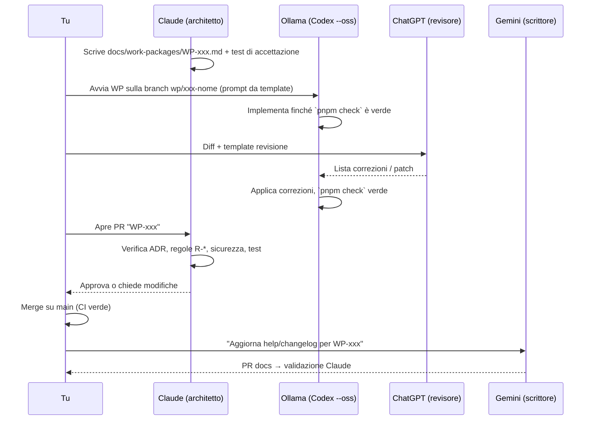

# 07 — Il team di IA: ruoli, strumenti, flusso di lavoro

## 1. Ruoli (chi decide cosa)

| Membro | Ruolo | Decide | Non fa mai |
|--------|-------|--------|------------|
| **Tu** | Fondatore, product owner, unico umano con accesso alla produzione | Priorità, perimetro, rapporti con legale/aziende/tester, merge finale | Incollare dati reali nelle IA |
| **Claude (Claude Code)** | **Architetto e validatore** | Architettura, ADR, specifiche dei WP, test di accettazione, approvazione dei merge, revisione di sicurezza. Scrive direttamente i moduli critici: **crypto, auth, privacy, zona gratuita (test)** | Delegare la crittografia a un modello locale |
| **Ollama (via Codex CLI `--oss`)** | **Sviluppatore** | Come implementare dentro i confini del WP | Cambiare architettura, aggiungere dipendenze non previste, toccare file fuori dal WP |
| **ChatGPT** | **Revisore e semplificatore** | Segnala bug, errori di tipo, problemi di sicurezza, semplificazioni; propone patch | Approvare merge; cambiare ADR (può solo proporne) |
| **Gemini** | **Scrittore** (uso intensivo) | Testi, documentazione, microcopy, bozze legali, contenuti marketing e SEO, dati di supporto (sinonimi, test in linguaggio naturale) | Pubblicare testi legali senza la revisione di Claude e del professionista |
| **ComfyUI** | **Studio grafico** | Proposte visive entro la guida di stile | Volti realistici spacciati per utenti reali; stili che imitano marchi altrui |

## 2. Strumenti e configurazione

### 2.1 Ollama + Codex CLI (sviluppo locale)
- **Codex CLI** di OpenAI supporta i modelli locali: `codex --oss` usa Ollama (modello predefinito `gpt-oss:20b`). Richiede Ollama recente e **almeno 32k token di contesto** (impostare `OLLAMA_CONTEXT_LENGTH=32768` o superiore).
- **Scelta del modello in base alla GPU:**

| Memoria GPU / unificata | Modello consigliato | Note |
|-------------------------|---------------------|------|
| 12-16 GB | `gpt-oss:20b` | Predefinito di Codex `--oss`, buon ragionamento |
| 24 GB | `qwen3-coder:30b` (MoE) o `devstral` | Molto buono su TypeScript |
| 64 GB+ | `gpt-oss:120b` | Il migliore in locale |
| < 12 GB | `qwen2.5-coder:7b/14b` | Solo WP piccolissimi; valutare di spostare più lavoro su ChatGPT |

- Config tipo `~/.codex/config.toml`: provider `ollama`, modello scelto, sandbox **workspace-write** (niente accesso di rete durante l'implementazione, niente accesso fuori dal repo).
- **Regola d'oro:** ogni WP ≤ ~300 righe modificate, 1-5 file, con **i test già scritti da Claude**: il modello deve "farli diventare verdi". I test sono il contratto.

### 2.2 ChatGPT (revisione)
- Due modalità: (a) **Codex CLI collegato all'account ChatGPT** (modello cloud) sulla stessa branch: legge il diff e propone correzioni; (b) ChatGPT web con il diff incollato o con il connettore GitHub.
- Usa sempre il template [prompts/chatgpt-revisione.md](prompts/chatgpt-revisione.md). L'output va salvato in `reviews/WP-xxx-chatgpt.md`.

### 2.3 Gemini (scrittura) — uso intensivo
- **Gemini CLI** nel repo (legge e scrive in `docs/`, `messages/`, `content/`) + Gemini web per lavori lunghi.
- Il contesto lungo di Gemini serve anche per il **controllo di coerenza**: una volta a settimana legge tutta la cartella `docs/` e segnala contraddizioni (es. un prezzo diverso in due documenti).
- **NotebookLM** (sempre Google) con le fonti normative di [02-REGOLE-DEL-GIOCO.md](02-REGOLE-DEL-GIOCO.md): utile per rispondere a domande puntuali citando la fonte.
- Template: [prompts/gemini-scrittura.md](prompts/gemini-scrittura.md).

### 2.4 ComfyUI (grafica)
- Modelli con **licenza commerciale**: **FLUX.1 [schnell]** (Apache 2.0) o **SDXL** (OpenRAIL++). **Non** usare FLUX.1 [dev] per materiale del progetto senza licenza commerciale di Black Forest Labs.
- Workflow salvati in `design/comfyui/*.json` con modello, seed e prompt → riproducibili.
- Il logo si usa come **bozza**: va poi ridisegnato a mano in vettoriale (Inkscape). Un'immagine interamente generata dall'IA ha una tutela d'autore debole (in Italia la L. 132/2025 protegge le opere "frutto del lavoro intellettuale umano"); il **marchio** si registra comunque all'UIBM.
- Template: [prompts/comfyui-brief.md](prompts/comfyui-brief.md).

## 3. Il flusso di un work package

### Convenzioni
- Branch: `wp/011-onboarding-azienda`, `docs/regolamento-annunci`, `fix/…`.
- Commit: `WP-011: verifica P.IVA tramite VIES` (in italiano o inglese, ma coerenti).
- PR: titolo `WP-011 — Onboarding azienda`, descrizione con: criteri di accettazione spuntati, regole R-* toccate, esito revisione ChatGPT, rischi.
- Una sola branch attiva per volta per il modello locale (evita conflitti che non sa risolvere).

## 4. Definition of Done (per ogni WP)
- [ ] Tutti i criteri di accettazione del WP soddisfatti
- [ ] Test nuovi presenti e verdi; `pnpm check` verde; CI verde
- [ ] Nessuna dipendenza nuova non prevista dal WP (o approvata da Claude)
- [ ] Regole R-* citate nel WP rispettate e verificate da test dove possibile
- [ ] Nessun dato personale in log, errori, URL, analytics
- [ ] Testi UI in `messages/it.json` (niente stringhe cablate)
- [ ] Accessibilità di base (etichette, focus, contrasto)
- [ ] Revisione ChatGPT salvata; osservazioni risolte o motivate
- [ ] Validazione Claude
- [ ] Documentazione/changelog aggiornati (Gemini)

## 5. Regole di sicurezza per tutte le IA
1. **Mai dati reali** di utenti in prompt, file del repo, screenshot condivisi. Solo seed sintetici (nomi palesemente finti).
2. **Mai segreti** (chiavi, password, token) nel repo o nei prompt. `.env` è in `.gitignore`; si usa `.env.example`.
3. Le CLI (Codex, Gemini CLI, Claude Code) girano **solo** sul repo di sviluppo, **mai** con credenziali di produzione.
4. Disattivare l'addestramento sulle conversazioni in ChatGPT e Gemini.
5. Ogni testo legale scritto da Gemini porta l'intestazione **"BOZZA — da validare con professionista"** finché non è revisionato.
6. Ogni dipendenza npm proposta da un'IA si verifica (esiste davvero? è mantenuta? nome esatto?) — i modelli a volte **inventano pacchetti** (rischio di "slopsquatting": pacchetti malevoli registrati con nomi inventati dalle IA).

## 6. Backlog di Gemini (in ordine di priorità)

| ID | Documento/contenuto | Serve per | Entro |
|----|---------------------|-----------|-------|
| G-01 | `messages/it.json` iniziale + glossario UI | WP-009 | 29/09 |
| G-02 | Bozza statuto ETS + atto costitutivo | Associazione | 29/09 |
| G-03 | Bozze: informativa lavoratori, informativa aziende, cookie policy, T&C lavoratori, T&C aziende | Legale | 01/10 |
| G-04 | Scheda Play Store (titolo ≤30, breve ≤80, completa ≤4000 caratteri), risposte Data safety | Play | 02/10 |
| G-05 | 300 mansioni con sinonimi colloquiali (CSV: etichetta, sinonimi, codice ISCO/ESCO) | WP-006 | 03/10 |
| G-06 | Script di contatto aziende (telefono, email, di persona) + one-pager "perché pubblicare qui" | Mercato | 30/09 |
| G-07 | Regolamento annunci + "Come riconoscere le truffe" | WP-012/013 | 05/10 |
| G-08 | Termini vietati/sospetti negli annunci con motivazione e alternativa suggerita | WP-012 | 06/10 |
| G-09 | Testi di aiuto del form offerta (trasparenza retributiva spiegata semplice) | WP-013 | 07/10 |
| G-10 | Modelli per pagine SEO "Lavoro [mansione] a [provincia]" | WP-014 | 08/10 |
| G-11 | "Chi siamo", "Come funziona il matching", "La tua privacy in parole semplici" | Fiducia | 10/10 |
| G-12 | Testi onboarding lavoratore | WP-017 | 12/10 |
| G-13 | Template email (benvenuto, OTP, candidatura inviata/vista/chiusa, avvisi, mensile, pausa, preavviso cancellazione) | WP-019-021 | 13/10 |
| G-14 | Pagina crowdfunding, FAQ, ricompense, 8 aggiornamenti, script video 60" | Crowdfunding | 15/10 |
| G-15 | DPIA, registro trattamenti, procedura data breach, modello informativa per aziende | Privacy | 20/10 |
| G-16 | Help center: 20 FAQ lavoratori + 20 aziende | Supporto | 22/10 |
| G-17 | Comunicato stampa, kit stampa, piano social (ottobre-dicembre), post per gruppi locali | Lancio | 23/10 |
| G-18 | Scenari di test in linguaggio naturale (Gherkin) dai criteri di accettazione | WP-028 | continuo |
| G-19 | Seed sintetici: 100 aziende, 500 offerte, 1.000 profili (dati palesemente finti) | Sviluppo | 05/10 |
| G-20 | Rapporto settimanale + controllo di coerenza di `docs/` | Governance | ogni domenica |
| G-21 | Changelog e note di rilascio | Tester/utenti | a ogni rilascio |
| G-22 | Guide SEO: "Annuncio di lavoro a norma nel 2026", "I tuoi diritti quando ti candidi", "Tirocinio: quanto ti spetta nella tua regione" | Traffico | novembre |

## 7. Backlog di ComfyUI

| ID | Asset | Specifiche | Entro |
|----|-------|-----------|-------|
| V-01 | Concept logo (20 proposte) → 1 scelta → vettoriale a mano | Semplice, leggibile a 48 px, 2 colori | 30/09 |
| V-02 | Icona app | 512×512 PNG (Play) + icona adattiva (primo piano/sfondo separati) + icone PWA 192/512 + maskable | 30/09 |
| V-03 | Feature graphic Play | 1024×500, niente testo piccolo | 30/09 |
| V-04 | Illustrazioni onboarding (3) e stati vuoti (4) | Stile coerente, persone stilizzate e **diverse** (età, genere, origine), niente fotorealismo | 04/10 |
| V-05 | Icone 20 macro-categorie di mansioni | Set coerente (stesso seed/stile) | 09/10 |
| V-06 | Immagini crowdfunding + social | 1200×630, 1080×1080, 1080×1920 | 16/10 |
| V-07 | Cornici per screenshot Play Store | 8 schermate | 24/10 |

Regola: nessuna immagine di "persone reali" o testimonianze inventate; per le immagini Open Graph delle offerte si
generano **al volo** dal server (niente ComfyUI).

## 8. Anti-pattern da evitare
- ❌ "Ollama, crea l'app di HR" → prompt troppo grande: il modello inventa. ✅ Un WP alla volta.
- ❌ Accettare codice che "sembra funzionare" senza test. ✅ I test li scrive prima Claude.
- ❌ Fare correggere a ChatGPT e poi a Gemini lo stesso codice: pareri in conflitto. ✅ Codice = Ollama/ChatGPT/Claude; testi = Gemini.
- ❌ Lasciare che un'IA aggiorni versioni di librerie "già che c'è". ✅ Solo in WP dedicati.
